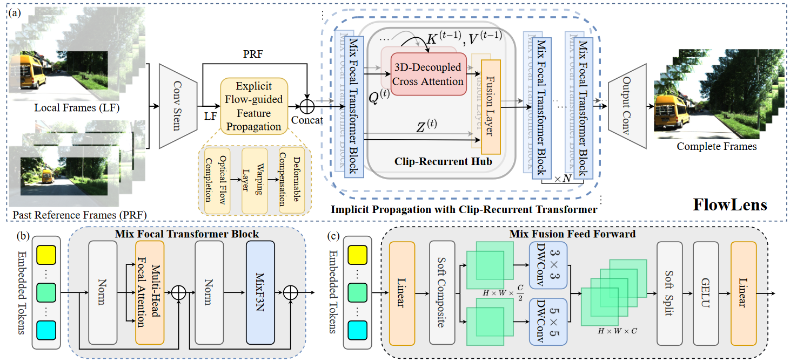

### <p align="center">FlowLens: Seeing Beyond the FoV via Flow-guided Clip-Recurrent Transformer
<br>
<div align="center">
  <a href="https://www.researchgate.net/profile/Shi-Hao-10" target="_blank">Hao&nbsp;Shi</a> &emsp; <b>&middot;</b> &emsp;
  <a href="https://www.researchgate.net/profile/Qi-Jiang-63" target="_blank">Qi&nbsp;Jiang</a> &emsp; <b>&middot;</b> &emsp;
  <a href="https://www.researchgate.net/profile/Kailun-Yang" target="_blank">Kailun&nbsp;Yang</a> &emsp; <b>&middot;</b> &emsp;
  <a href="https://www.researchgate.net/profile/Yin-Xiaoting" target="_blank">Xiaoting&nbsp;Yin</a> &emsp; <b>&middot;</b> &emsp;
  <a href="https://www.researchgate.net/profile/Kaiwei-Wang-4" target="_blank">Kaiwei&nbsp;Wang</a>
  <br> <br>
  <a href="https://arxiv.org/pdf/2211.11293.pdf" target="_blank">Paper</a>

####
[](https://paperswithcode.com/sota/seeing-beyond-the-visible-on-kitti360-ex?p=flowlens-seeing-beyond-the-fov-via-flow)

[comment]: <> (<a href="https://arxiv.org/" target="_blank">Paper</a> &emsp;)

[comment]: <> (  <a href="https://arxiv.org/" target="_blank">Demo Video &#40;Youtube&#41;</a> &emsp;)

[comment]: <> (  <a href="https://arxiv.org/" target="_blank">演示视频 &#40;B站&#41;</a> &emsp;)
</div>
<br>
<p align="center">:hammer_and_wrench: :construction_worker: :rocket:</p>
<p align="center">:fire: We will release code and checkpoints in the future. :fire:</p>
<br>

<div align=center></div>

### Update
- 2022.11.21 Release the [arXiv](https://arxiv.org/abs/2211.11293) version with supplementary materials.

### TODO List

- [ ] Code release. 
- [ ] KITTI360-EX release.
- [ ] Towards higher performance with extra small costs.


### Abstract
Limited by hardware cost and system size, camera's Field-of-View (FoV) is not always satisfactory. 
However, from a spatio-temporal perspective, information beyond the camera’s physical FoV is off-the-shelf and can actually be obtained ''for free'' from past video streams. 
In this paper, we propose a novel task termed Beyond-FoV Estimation, aiming to exploit past visual cues and bidirectional break through the physical FoV of a camera.
We put forward a FlowLens architecture to expand the FoV by achieving feature propagation explicitly by optical flow and implicitly by a novel clip-recurrent transformer, 
which has two appealing features: 1) FlowLens comprises a newly proposed Clip-Recurrent Hub with 3D-Decoupled Cross Attention (DDCA) to progressively process global information accumulated in the temporal dimension. 2) A multi-branch Mix Fusion Feed Forward Network (MixF3N) is integrated to enhance the spatially-precise flow of local features. To foster training and evaluation, we establish KITTI360-EX, a dataset for outer- and inner FoV expansion. 
Extensive experiments on both video inpainting and beyond-FoV estimation tasks show that FlowLens achieves state-of-the-art performance.

### Demos

<p align="center">
    (Outer Beyond-FoV)
</p>
<p align="center">
    
</p>
<br><br>

<p align="center">
    (Inner Beyond-FoV)
</p>
<p align="center">
    
</p>
<br><br>

<p align="center">
    (Object Removal)
</p>
<p align="center">
    
</p>
<br><br>

### Citation

   If you find our paper or repo useful, please consider citing our paper:

   ```bibtex
   @article{shi2022flowlens,
  title={FlowLens: Seeing Beyond the FoV via Flow-guided Clip-Recurrent Transformer},
  author={Shi, Hao and Jiang, Qi and Yang, Kailun and Yin, Xiaoting and Wang, Kaiwei},
  journal={arXiv preprint arXiv:2211.11293},
  year={2022}
}
   ```
